#  Binary-Analysis-of-Hello-World

Tools used:

- g++ compiler for c++
- gcc compiler for c
- objdump
- gdb disassembler
- notepad ++
- MobXterm SSH Client
- r2 disassembler

------

As most people know, there is always more then one way to achieve a goal. Today I will be looking at the differences between C and C++ when disassembled. Specifically, we want to take a look a simple hello world program. We will start by looking at the source code.

Hello world in C (hello1.c)

```c
#include <stdio.h>
int main() {
   printf("Hello World");
   return 0;
}

```

Hello world in C++ (hello.cpp)

```c++
#include <iostream>
int main() {
std::cout << "Hello World";
return 0;
}
```

Very similar looking code, same output when ran, but do they operate the same way?

Lets compile, run, and disassemble them.

```
root@slae-virtual-machine:~/dev/001-helloworld# uname -a
Linux slae-virtual-machine 5.4.0-58-generic #64~18.04.1-Ubuntu SMP Wed Dec 9 17:00:52 UTC 2020 i686 i686 i686 GNU/Linux
```

ubuntu-18.04.5-desktop-i386 for reference to the OS

```bash
g++ hello.cpp -o hello
gcc hello.c -o hello1

objdump -M intel -d hello > hello.objdump  
objdump -M intel -d hello1 > hello1.objdump

#-M Intel - Sets the disassebly language to intel syntax
#-d - disassebles the program
```

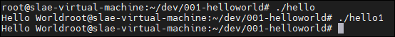

Running the programs look a bit weird, but that is because we did not add a newline character to the string (`\n`). But this confirms that they operate the exact same way.

When listing all the files we see interesting size differences.

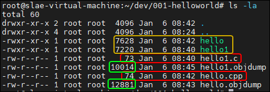

The source code for each executable are only about one byte off.

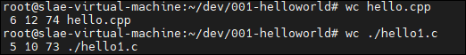

*`wc` output three intergers. (Lines, Characters, Bytes). `hello.cpp` has 6 lines, 12 characters, 74 bytes*

But when we look at the program sizes, we see that there is a 408 byte difference in size, with our c++ program being larger at 7628 bytes.

## C Program

We previously did an object dump on each program. Lets take a look at each.

### Static Analysis

We first start on `main` function of this dump

hello1.objdump

```
<snip>
0000051d <main>:
 51d:	8d 4c 24 04          	lea    ecx,[esp+0x4]
 521:	83 e4 f0             	and    esp,0xfffffff0
 524:	ff 71 fc             	push   DWORD PTR [ecx-0x4]
 527:	55                   	push   ebp
 528:	89 e5                	mov    ebp,esp
 52a:	53                   	push   ebx
 52b:	51                   	push   ecx
 52c:	e8 28 00 00 00       	call   559 <__x86.get_pc_thunk.ax>
 531:	05 a7 1a 00 00       	add    eax,0x1aa7
 536:	83 ec 0c             	sub    esp,0xc
 539:	8d 90 08 e6 ff ff    	lea    edx,[eax-0x19f8]
 53f:	52                   	push   edx
 540:	89 c3                	mov    ebx,eax
 542:	e8 69 fe ff ff       	call   3b0 <printf@plt>
 547:	83 c4 10             	add    esp,0x10
 54a:	b8 00 00 00 00       	mov    eax,0x0
 54f:	8d 65 f8             	lea    esp,[ebp-0x8]
 552:	59                   	pop    ecx
 553:	5b                   	pop    ebx
 554:	5d                   	pop    ebp
 555:	8d 61 fc             	lea    esp,[ecx-0x4]
 558:	c3                   	ret    
<snip>
```

Looking side by side with the source code, we can highlight and focus on the `printf@plt` call. They keyword `printf` appears in both the source code an the dump, so we can use it as are base point.

Source Code:

```c
printf("Hello World");
```

Objdump

```
542:	e8 69 fe ff ff       	call   3b0 <printf@plt>
```

We see that between the `call   559 <__x86.get_pc_thunk.ax>` and the `call   3b0 <printf@plt>`, only one push instruction was executed. As a reminder, when running a call, to pass parameters, typically you push your parameters to the stack (memory), and then put them back into the registers by use `mov eax,[esp-4]`. It is also important to remember that  the `call` instruction will also pop the next instruction onto the stack so you can not simply use `pop`.

```
 52c:	e8 28 00 00 00       	call   559 <__x86.get_pc_thunk.ax>
 531:	05 a7 1a 00 00       	add    eax,0x1aa7
 536:	83 ec 0c             	sub    esp,0xc
 539:	8d 90 08 e6 ff ff    	lea    edx,[eax-0x19f8] # We think that this address is the message
 53f:	52                   	push   edx
 540:	89 c3                	mov    ebx,eax
 542:	e8 69 fe ff ff       	call   3b0 <printf@plt>
```

We may need to switch to dynamic analysis to confirm.

### Dynamic Analysis

we open the program in gdb, set the syntax to intel, break on main, and work from there.

```
gdb hello1
info func
<snip>
0x00000519  __x86.get_pc_thunk.dx
0x0000051d  main
0x00000559  __x86.get_pc_thunk.ax
<snip>
break main
set disassembly-flavor intel
run
Breakpoint 1, 0x0040052c in main ()
```

We see that the first breakpoint is hit and where is started by the small arrow beside the instruction.

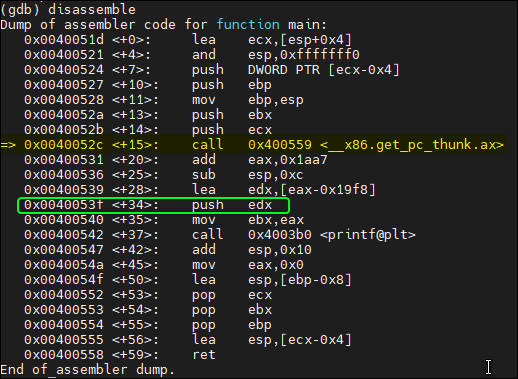

We want to add a breakpoint at 0x0040053f as it is after `edx` get the address of the potential address.

```
break *0x0040053f
cont
```

We hit our second breakpoint. We display `edx`to see what address is currently inside of it, as defined by `lea edx,[eax-0x19f8]` (Load effect address, instruction copies the memory address rather then the contents of of variable).

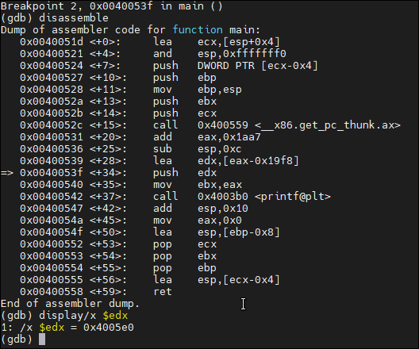

The `display/x $edx` will display the contents of the `edx` register. We can use this to view the contents of that memory address.

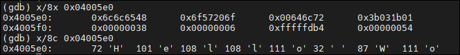

We first use the command `x/8x 0x04005e0` which output the 8 bytes in hex starting from `0x4005e0`. We see that it is the contents of the Hello World string. We can confirm that memory address for the `Hello World` string is being pushed to the stack. the call to `printf` is made and that is when the string gets printed.

## C ++ 


### Static Analysis

If we take a look at the `main` function from the C++ Application dump, we see that the setup and deployment look very similar to the C variant.

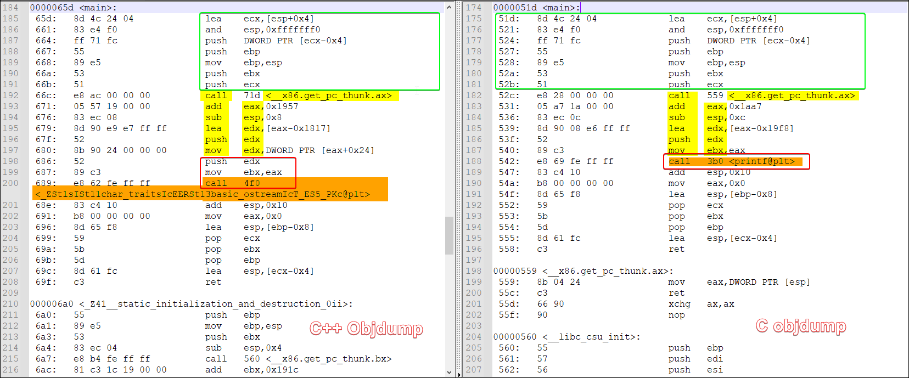

The setup in the green box is identical although when we ran the C code in gdb and added a breakpoint to main, it stopped it at the first call. We are going to assume a `jmp` instruction to that address and will assume it will do so again here. The instruction highlighted in yellow are the same although the amount of bytes being moved around are a little different for each instruction. Example, the subtraction in the C++ application takes away 8 when the C application takes away 13(0xc in hex). We can ignore these small changes for now. What we can see it that based of the instructions, we believe that once again, we are setting up the address of the string `Hello world` to be pushed to the stack.

Here is when things go a little differently. Instead of the immediate call to the function, we mov ` eax+0x24`  to `edx` again, and then also push that to the stack. We then move `eax` to `ebx` again. Lets focus on the the second push `edx` in the red box. 

I will make a guess here that potentially this would be the length of the string?

Before I jump over to Dynamic analysis, let me quick look up that giant call to a weirdly named function. A quick search does not yield many results.

### Dynamic Analysis 

```
gdb hello
break main
set disassembly-flavor intel
run
```

We hit our break point, and as we see above, we start exactly like we did before at the first call.

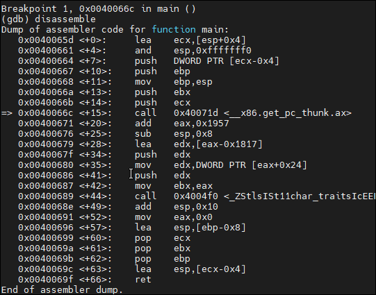

Like we did before, we want to confirm that just before the first `push edx`, that `edx` contains the address to our string. For simplicity sake, I define a hook-stop that will auto run the command disassemble on every stop. I also add two display commands. One for `eax` and one for `edx` 

```
define hook-stop
disassemble
end
display/x $eax
display/x $edx
```

I also add a breakpoint at the highlight section.

```
break *0x0040067f
Breakpoint 2 at 0x40067f
```


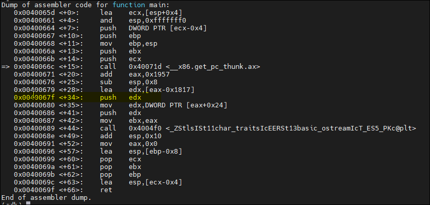

We stop at the first breakpoint, just before `edx` gets pushed onto the stack. `edx` contains the address `0x4007b1` which we believe is our string. We can confirm with the command `x/16c 0x4007b1`.

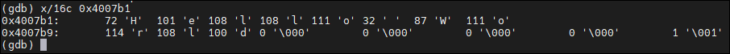

Sure enough, there it is. We now move onto the second `push edx` instruction. 

We move forward 2 instructions right before we run the second push.

We run `x/8c` out to find the current address in `edx` resides in `_ZSt4cout`. Although the contents of the memory address don't lead to much, the location shows something interesting. It is located in the `_ZSt4count`!

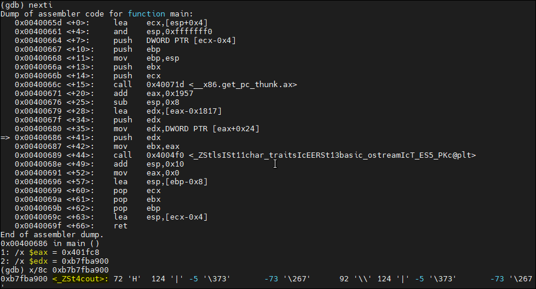

Seem familiar? 
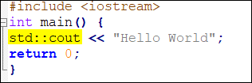

Because `_ZSt4cout` was not in the objdump, we learn that this function must have been imported somehow.

So from the looks of things, the first parameter that was pushed to the stack was the location of the string `Hello World` and the second parameter would be the newly imported function `_ZSt4cout`.

Running `info func` will show what other funcs have been initialized while running.

Unfortunately, waaaay to many functions were imported to navigate easily. And a quick search shows no results for `cout`

Still curious to what is going on with the giant call, I put a break point to `_ZStlsISt11char_traitsIcEERSt13basic_ostreamIcT_ES5_PKc@plt`

While looking though this disassemble, we encounter a call to `strlen@plt` which looks pretty promising.

In raw assembly, we know that before calling a syscall to print out text, it need parameters like string length, the position of the string in memory, if it is treated like an output or input (stout/stin). We might be able to assume the same here.

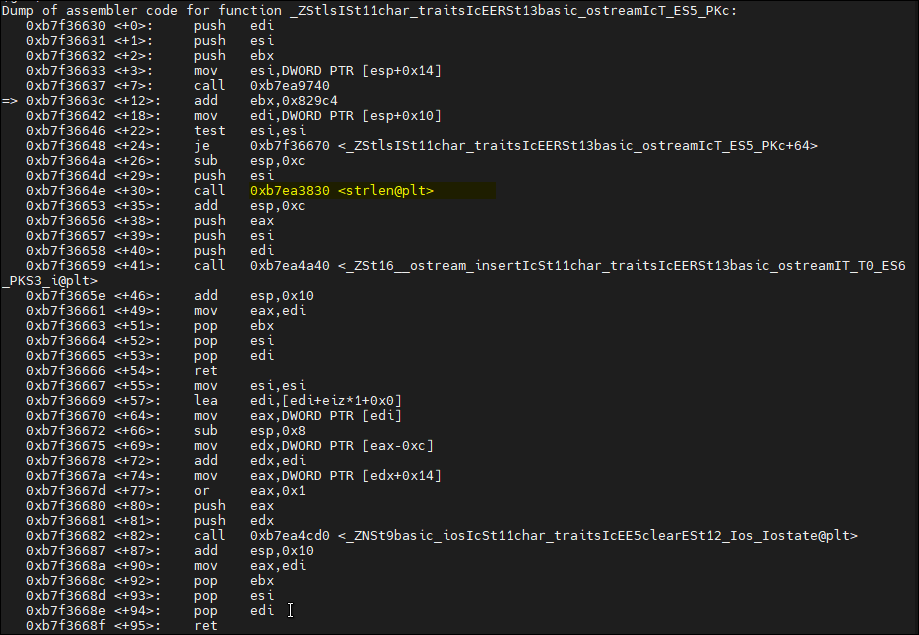

I did add a breakpoint to this function as well but it led me down a rather deep rabbit hole of jump calls. I think it might be time to explore a more visual disassembler. I will be forth coming that I am not as skilled with r2 as I am gdb but no time to learn like in the field right?

### R2 

We start the program with `r2 hello`

We start by running the `aaa` command. This will start to analyze  flag, functions, instruction and more.

 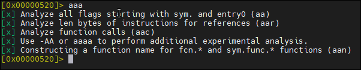

 We run `afl` to list the functions

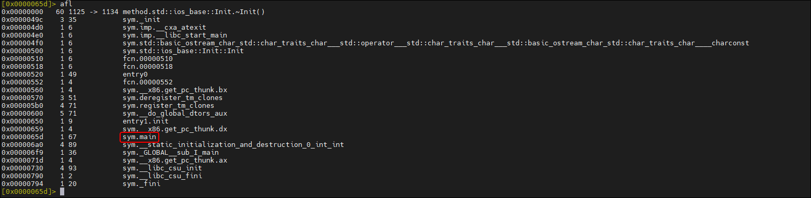


We see the sym.main function. We can seek to this function using `s sym.main`.

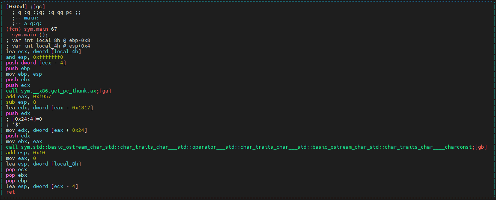

When opening up the application, we notice that is self contained with no `jmp` instructions, and a couple of `call`. Identical to what the output of gdb was. I wasn't sure if anything else would pop up, but it is good practice to double check in a few tools.

## Research

Now that we have finished up some light analysis, we can start doing some research. We can use the following finds to conduct some basic google searchs.

```
ZStlsISt11char_traitsIcEERSt13basic_ostreamIcT_ES5_PKc@plt
_ZSt4cout
strlen@plt
sym.std::basic_ostream_char_std::char_traits_char___std::operator___std::char_traits_char___std::basic_ostream_char_std::char_traits_char____charconst
```

We find some very promising results when looking up `_ZSt4cou`

Using this info we found by going a few steps deeper, we learn why the C++ executable is so much larger despite the source code only being a couple bytes longer.


> What you are paying for is to call a heavy library (not as heavy as printing into console). You initialize an `ostream` object. There are some hidden storage. Then, you call `std::endl` which is not a synonym for `\n`. The `iostream` library helps you adjusting many settings and putting the burden on the processor rather than the programmer. This is what you are paying for.

https://stackoverflow.com/questions/52442415/in-c-am-i-paying-for-what-i-am-not-eating/52445395

According to the above link, the reason why this is so much larger, is because when importing the `<iostream>` library in the cpp source code, your importing more the just a simple print statement. This `std::cout` function has many more functions like formatting, locals, as well as any other function that might be in `std` .

We also learn that we could call `printf` in c++ by using the cstdio library!

## Rebuilding using a smaller library

We rebuild our c++ code using the new library and call it hello2.cpp

```c++
#include <cstdio>
int main(){
printf("Hello World");
return 0;
}
```

We compile it with g++, create an objdump, and run the program.

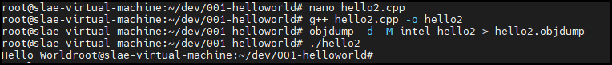

We see the program run the same way as the other ones did.

Lets check the sizes.

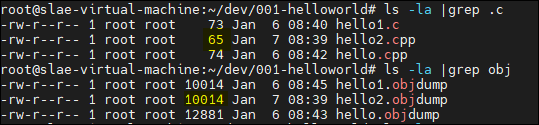

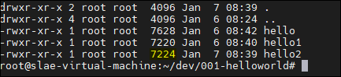

We find a few shocking results. The source code is dramatically smaller the it C counterpart by 8 bytes, the objdump is the same size, and the executable is only 4 bytes larger then the C executable.

To ensure the wasn't an error, in my commands I opened each object dump and compared the first line.

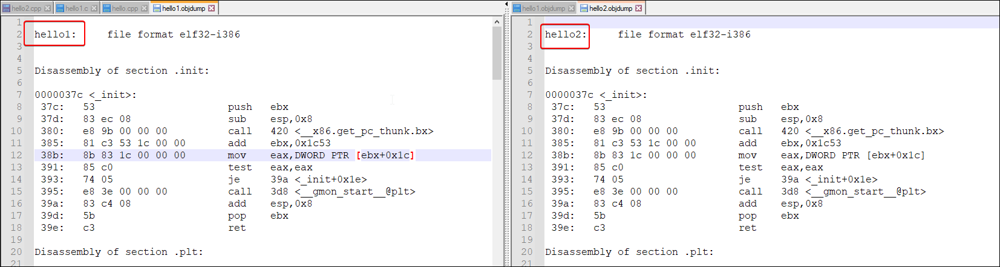

Sure enough the header is different and reflected to each program. What is even more increadle (at least to me), was that when comparing them side by side, the file are completely identical (besides the header).

To double check, I recompiled each executable and remade the objdump is the results were the same again.

Using the diff command we see that once again only the header was different.

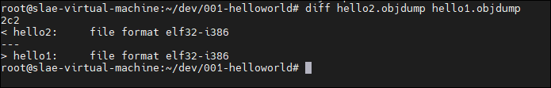

## Conclusion

So are main goals where the differences between C and C++ were using two hello world programs. When teaching us the "Hello world", in C++, we are taught to use `std::cout << "Hello world"` instead of C `printf("Hello World")` even though both will print the same result in the end. Why? Because using the `iostream` library will allow for more versatility in the future like formatting or locational syntax in the future as opposed to `printf` which only outputs what is taken. But my doing so, you are creating a larger executable that operates  very differently at the processor level. We also learn that you can compile C code in C++ and get an almost identical executable as you would if compiled in C at the assembly level. 


This is my first Reverse Engineering write up. Although very basic, was my first time doing it unguided. I hope I can take what I have learned here build onto more advanced topic. Thank you.